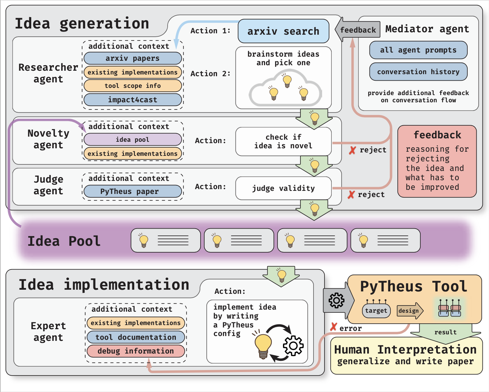

# AI-Mandel -- A prototype AI-physicist

**Towards autonomous quantum physics research using LLM agents with access to intelligent tools**\
_Sören Arlt, Xuemei Gu, Mario Krenn_\
[https://arxiv.org/abs/2511.11752](https://arxiv.org/abs/2511.11752)



This repo implements *AI-Mandel*, a multi-agent workflow to generate quantum optics research ideas and implement them them in PyTheus. It’s centered around three scripts:

- `researchers.py` — drives a Researcher → Novelty Supervisor → Judge loop to produce concise abstracts and logs.
- `prep_expert.py` — prepares decision files (“prepped_*.txt”) by transforming the last Researcher message into a Pytheus-ready configuration prompt.
- `expert.py` — runs the Expert agent to produce/validate configurations and executes Pytheus with timeouts, saving final results and journal entries.

## High‑level flow

1) Research ideas (researchers loop)
- The Researcher proposes an idea and iterates with the Novelty Supervisor (and an optional Mediator) to refine novelty. If accepted, a short two‑sentence abstract is written to the ensemble directory and a detailed JSON log is saved under an `ensemble_runs/` subfolder.

2) Prepare an expert decision (preparation)
- For each abstract produced in step 1, the preparation script extracts the last non‑summarizing Researcher message from the matching run log. It composes a prompt with Pytheus capabilities/limitations and curated examples, optionally adding a “domain expert feedback” section when a feedback file is provided. The model then outputs a Thought / Action / Action Input, where the Action Input is an improved configuration JSON. This is saved as `prepped_{timestamp}.txt` next to the abstract.

3) Execute with Pytheus (expert run)
- The Expert agent builds its prompt from the abstract, the last Researcher message, the preparation decision (“prepped_*.txt”), Pytheus infos, and example snippets. It asks the model to produce a valid configuration; the script writes the config to disk and then runs `pytheus` via `run_main` in a sandboxed subprocess with a timeout. Final results and a journal entry are written to the configured journal directory.

The three stages are independent scripts so you can run them end‑to‑end or selectively.

## Inputs and artifacts

Centralized in `assets/`:

- Prompts (text files)
  - Researchers loop: `assets/PROMPT_RESEARCHER.txt`, `assets/PROMPT_NOVELTY.txt`, `assets/PROMPT_JUDGE.txt`
  - Expert: `assets/PROMPT_EXPERT.txt`
- Domain knowledge:
  - `assets/PYTHEUS_EXPLICIT_INFOS.txt` — capabilities/limitations and usage notes
  - Pytheus examples under `assets/pytheus_examples/{States,Gates,Measurements,Communication}` with `explanation.txt` and `config*.json`
- Data files (used by scripts as configured):
  - `assets/100states.txt` or `assets/100states_medium.txt`, `assets/filtered_future_suggested_pairs_IR10.txt`, `assets/pytheus_fullpaper.txt`, `assets/recent_quantum_papers.json`
  - Optional feedback file (only for preparation step)
- Outputs
  - Researchers: `ensemble/abstracts_{timestamp}.txt`, logs under `ensemble/ensemble_runs/o4-mini_*`
  - Preparation: `prepped_{timestamp}.txt` (in the same ensemble dir by default)
  - Expert: run directory with configs and `final_result_*`, plus `journal_*.txt` under the journal directory

## Models and API usage

All scripts use OpenAI chat completions with the `o4-mini` model and do not pass a temperature parameter. API key is read from the environment variable `OPENAI_API_KEY` or (as a fallback) from `API_key.txt` when present.

## Setup and install

- Python 3.9+ recommended
- Install dependencies:
  - Using pip: `pip install -r requirements.txt`
- Provide your API key by either:
  - Setting the environment variable `OPENAI_API_KEY`, or
  - Creating a file `API_key.txt` with your key.

## Scripts and CLI

### 1) researchers.py

- Purpose: Generate abstracts by running the Researcher → Novelty Supervisor → Judge loop; log the full conversation; write short abstracts to the ensemble directory.
- Key flags (subset; defaults shown):
  - `--ensemble-dir ENSEMBLE_DIR` (default varies per repo setup)
  - `--journal-dir JOURNAL_DIR`
  - `--all-journals` (aggregate previous results across any `journal*/` folders)
  - `--max-researcher-calls N`
- Notes:
  - Uses optional arXiv search; if the `arxiv` package isn’t installed, the step is skipped gracefully.
  - Saves a snapshot of prompts in the run directory for reproducibility.

Example:
```
python3 researchers.py \
  --ensemble-dir ensemble \
  --journal-dir journal_o4-mini \
  --all-journals \
  --max-researcher-calls 20
```

### 2) prep_expert.py

- Purpose: For each `abstracts_{timestamp}.txt`, extract the last Researcher message from the corresponding run logs and prepare `prepped_{timestamp}.txt` with an improved Pytheus config prompt.
-- Key flags:
  - `--ensemble-dir ENSEMBLE_DIR` (default `ensemble`)
  - `--examples-root assets/pytheus_examples`
  - `--pytheus-infos assets/PYTHEUS_EXPLICIT_INFOS.txt`
  - `--feedback-file PATH` (optional; if omitted or missing, the feedback section is skipped)
  - `--id abstracts_*.txt` (optional; process a single abstract)
  - `--output-dir DIR` (default: same as `--ensemble-dir`)
  - `--seed N` (optional; determinism for example ordering)

Examples:
```
# Process all abstracts in the directory
python3 prep_expert.py \
  --ensemble-dir ensemble \
  --examples-root assets/pytheus_examples \
  --pytheus-infos assets/PYTHEUS_EXPLICIT_INFOS.txt

# Process a single abstract and include a feedback file
python3 prep_expert.py \
  --ensemble-dir ensemble \
  --id abstracts_2025_11_12_1507_09.txt \
  --feedback-file combined_abstracts_20250808_1905_feedback.txt
```

### 3) expert.py

- Purpose: Run the Expert agent to create a valid Pytheus config and execute it with a timeout; write journal entries and final results.
- Key flags:
  - `--ensemble-dir ENSEMBLE_DIR` (default `ensemble_mediator_mario`)
  - `--journal-dir JOURNAL_DIR` (default `journal_o4-mini`)
  - `--all-journals` (aggregates previous results in prompts)
  - `--id abstracts_*.txt` (optional; otherwise a random one is picked)
  - `--max-internal-expert-calls N`, `--max-external-expert-calls N`, `--max-researcher-calls N`
  - `--openai-api-key-file PATH` (optional)

Example:
```
python3 expert.py \
  --ensemble-dir ensemble \
  --journal-dir journal_o4-mini \
  --all-journals
```

## Troubleshooting

- Missing API key
  - Set `OPENAI_API_KEY` or place a key in `API_key.txt`.
- Missing feedback file (preparation)
  - The script continues without the feedback section and prints a warning.
- No matching run directory for an abstract
  - Ensure the `abstracts_{timestamp}.txt` belongs to a run with a directory containing that timestamp under `ensemble_dir/ensemble_runs/`.
- Pytheus timeout or JSON decode errors
  - The Expert script captures the exception, logs a debugging message, and continues based on the call budget limits.
